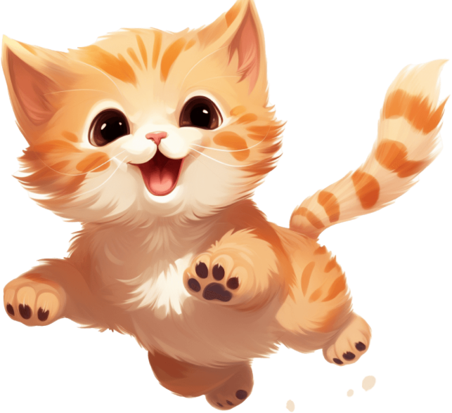

<!DOCTYPE html>
<html lang="en">
<head>
    <meta charset="UTF-8">
    <meta name="viewport" content="width=device-width, initial-scale=1.0">
    <title>Kitty Food</title>
    <link rel="preconnect" href="https://fonts.googleapis.com">
    <link rel="preconnect" href="https://fonts.gstatic.com" crossorigin>
    <link rel="stylesheet" href="C:\Users\raiya\OneDrive\Desktop\New folder\main1.css">
</head>
<body>
  
        

            <header>
                

                    
                    

                    <a href="#" class="home hide-mobile"><h3>Home</h3></a>
                

    
                <nav>
                    
                    <ul>
                        <li class = "hide-desktop">
                            
                        </li>
                        <li><a href="#">Our Food</a></li>
                        <li><a href="#">Doctors</a></li>
                        <li><a href="#">Toys</a></li>
                        <li><a href="#">FAQ</a></li>
                    </ul>
                </nav>
            </header>
    
            <main>
                <h1>Your pet will go </h1>
                

                   <h3>..Your one stop solution for all the problems 
                    you face with you pets.</h3> 
                    
                

                <a href="#" class="primary-cta">Get Bonkers</a>
            </main>
    
            

                

                    
                    

                    

                

            

        

    
        
        
    

</body>
</html>
